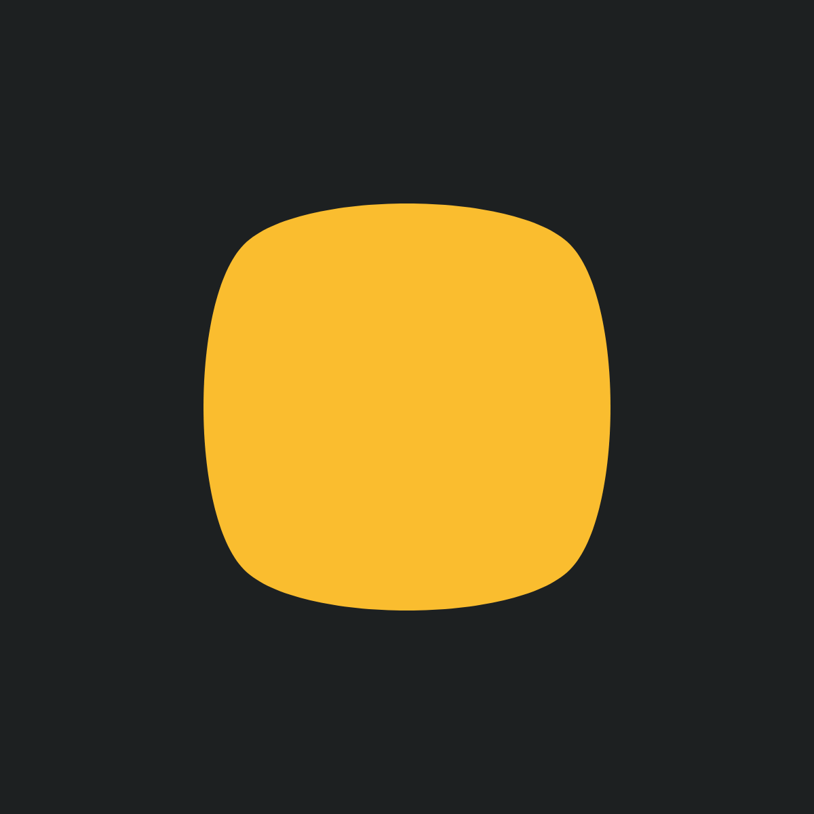

# Shapes
## 2026-02-01 In progress

Something simple is often a good starting point. And sometimes something simple is just perfect. Making a computer generate even something simple always feels like an achievement, and today I use the html canvas library p5.js to engulfe in some beautiful simple shapes. And colors. No disrespect to the primary colors, but anything slighlty off is so much prettier.

With p5 (and I believe html canvas as well) an rectangle is easily created. The colors are chosen from the _gruvbox_ theme with a dark grey background color `#1D2021` and a bluish foreground color `#83A598`. Gruvbox is a color theme originally from the Vim editor.
```js
rect(width/2, height/2, width*0.6, height*0.6);
```
<p align="center"></p>

Standard functions exists for changing the corner radius. This leaf has the greenish color `#689d6a` also from the gruvbox palette
```js
rect(width/2, height/2, width*0.6, height*0.6, width*0.3, 0, width*0.3, 0);
```
<p align="center"></p>

Some more organic shapes can easily be created using curves and vertices. There are some built-in possibilities in p5. Be aware that between p5 1.x and 2.0 some creative control was lost when the _curveVertex_ was removed and the _splineVertex_ was added. After creating the four corners the p5 function _splineVertex_ is used to draw a smooth continous curve which creates this beautiful rectangle in gruvbox yellow `#FABD2F`.

```js
    // Centered rectangle
    let x0 = width * 0.3;
    let y0 = height * 0.3;
    let nodes = [
      { x: x0, y: y0},
      { x: width - x0, y: y0},
      { x: width - x0, y: height - y0},
      { x: x0, y: height - y0},
    ]

    // curveVertex is removed in p5.js 2.0
    beginShape();
    for (let i = 0; i < nodes.length; i++) {
      let n = nodes[i];
      splineVertex(n.x, n.y);
    }
    endShape(CLOSE);
```
<p align="center"></p>
